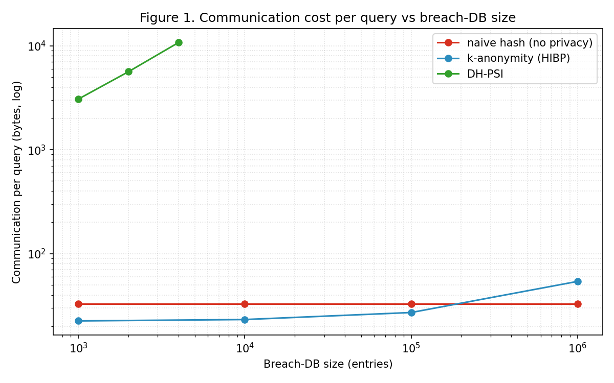
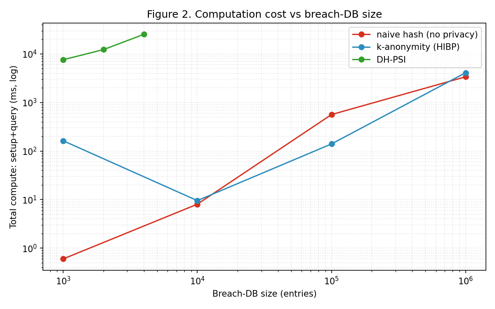
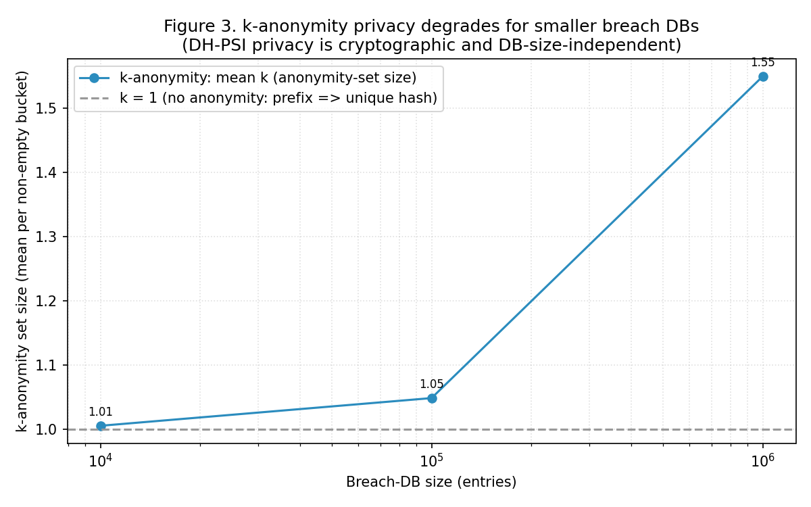

# 1. Introduction

Password breach-checking has become a standard account-security feature: before
accepting a password, a service (or a browser, or a user) checks it against a
corpus of leaked credentials. The privacy challenge is obvious -- the client must
not simply send its password to a third party. The dominant deployed solution,
popularised by Have I Been Pwned (HIBP), is a **k-anonymity** range query: the
client hashes the password with SHA-1, sends only the first five hex characters
of the hash, and downloads every matching suffix to check locally. The server
sees only a prefix, which corresponds to a bucket ("anonymity set") of candidate
hashes.

A cryptographically stronger primitive exists: **Private Set Intersection (PSI)**
lets a client and server learn the intersection of their sets -- here, the
client's candidate passwords and the server's breach corpus -- while the server
learns nothing about the client's queries. PSI is the textbook answer to "check
membership privately," yet deployed breach-checkers use k-anonymity, presumably
for cost reasons. How large is that cost, and how much privacy does k-anonymity
actually give up? These questions are rarely answered side by side.

This paper provides that comparison. Our contributions are:

1. A uniform implementation and correctness check of three breach-checking
   protocols: a no-privacy hash-lookup baseline, HIBP-style k-anonymity, and a
   Diffie-Hellman PSI over a 2048-bit safe-prime group.
2. A measurement of their **communication, computation, and privacy** as the
   breach database grows, isolating where each protocol's cost and leakage lie.
3. A quantified statement of the trade-off and practical guidance, including the
   finding that k-anonymity's privacy degrades to near-nothing for small and
   medium breach databases.

# 2. Background and Related Work

## 2.1 k-Anonymity range queries (HIBP)

In the HIBP model the client computes SHA-1 of the password, transmits a 5-hex
prefix (2^20 buckets), and the server returns the suffixes of all breached hashes
sharing that prefix. The client matches locally. The server's knowledge is
limited to the prefix, i.e. a k-anonymity set whose size depends on how many
breached hashes fall in that bucket. This is cheap and stateless and underlies
browser password checkup features.

## 2.2 Private Set Intersection

PSI protocols let two parties compute the intersection of their private sets
without revealing the rest. The classic Diffie-Hellman construction blinds each
element by raising a hash-to-group representation to a secret exponent; because
exponentiation commutes, both parties can compare doubly-blinded elements without
learning the underlying values. PSI is widely studied and underlies private
contact discovery and private breach alerting proposals, but is heavier than a
prefix query.

## 2.3 Related deployments and our angle

Private breach checking is not only academic: Google's Password Checkup and
Apple's Password Monitoring are deployed services that use PSI- or OPRF-flavoured
protocols precisely to avoid the leakage of a prefix scheme, and there is an
established PSI literature behind them. We therefore do not claim PSI is untried;
rather, the deployed *prefix* (k-anonymity) design and a cryptographic PSI design
are seldom put on a common dataset with common metrics and a common privacy
yardstick. Our angle is that comparison, and in particular making the
k-anonymity privacy parameter explicit as a closed form rather than a black box.

# 3. Threat Model and Methodology

## 3.1 Threat model

The server is honest-but-curious: it follows the protocol but may try to infer
which credentials the client checks. We measure what the server learns about the
client's queries, and the client- and server-side cost of each protocol. We do
not consider a malicious server that deviates from the protocol, nor server-side
privacy beyond query confidentiality.

## 3.2 Protocols

- **Naive hash lookup (baseline, no privacy):** the client sends the full SHA-256
  hash; the server replies present/absent. The server learns the exact hash of
  every query. Included as a cost floor and privacy floor.
- **k-Anonymity (HIBP):** SHA-1, 5-hex prefix uploaded, matching bucket of
  suffixes returned, matched locally. The server learns the prefix (anonymity
  set).
- **DH-PSI:** Diffie-Hellman PSI over the RFC 3526 2048-bit MODP safe prime.
  Elements are hashed into the quadratic-residue subgroup and blinded with secret
  exponents; the client learns only the intersection and the server learns
  nothing about the queries (only their count).

## 3.3 Metrics and setup

For each protocol and breach-database size N (fixed client batch of 100, half
truly breached) we measure server-setup time, query time, total communication
(bytes), and verify that the recovered breached set is exactly correct. We
additionally characterise k-anonymity's privacy by the distribution of bucket
sizes (the anonymity-set size) as N grows. Breach corpora and client sets are
synthetic with controlled overlap; SHA hashing spreads them uniformly across
buckets. Modular exponentiation uses GMP (via gmpy2). The naive and k-anonymity
protocols are measured to N = 10^6; DH-PSI, being modexp-bound, is measured to N
= 4000 and its linear trend extrapolated.

# 4. Results

All three protocols recovered the identical, correct breached set (50/50 in every
configuration), confirming functional equivalence; they differ only in cost and
privacy.

## 4.1 Communication

Table 1 and Figure 1 report communication per query. k-Anonymity transmits only
tens of bytes per query (22.5 B at N = 10^3 rising slowly to 54 B at N = 10^6, as
buckets fill), comparable to the 33 B no-privacy baseline. DH-PSI transmits
3,072 B per query at N = 10^3, rising to 10,752 B at N = 4000 -- two to three
orders of magnitude more -- because it processes and transfers the entire blinded
server set (O(N)).

**Table 1. Communication per query (bytes), by breach-DB size.**

| Breach DB size | naive | k-anonymity | DH-PSI |
|---|---:|---:|---:|
| 1,000 | 33 | 22.5 | 3,072 |
| 10,000 | 33 | 23.2 | -- |
| 100,000 | 33 | 27.1 | -- |
| 1,000,000 | 33 | 54.0 | -- |
| (DH-PSI 2,000 / 4,000) | -- | -- | 5,632 / 10,752 |

## 4.2 Computation

Figure 2 shows total compute (setup + query). Naive and k-anonymity are
hash-bound: queries are sub-millisecond and even building a 10^6-entry index
takes a few seconds once. DH-PSI is exponentiation-bound: at N = 4000 setup and
query together take roughly 25 seconds, and the cost grows linearly with N. The
gap is about four orders of magnitude at comparable database sizes.

## 4.3 Privacy

The privacy picture inverts the cost picture, and k-anonymity's privacy is best
understood not as an empirical surprise but as a direct consequence of the prefix
length. A p-bit (here, 5 hex = 20-bit) prefix partitions the hash space into 2^p
buckets, so for a uniformly hashed corpus of N entries the expected anonymity set
is simply **k ~ N / 2^p**. Our experiment is therefore a confirmation of this
arithmetic, not an independent discovery -- and that is exactly why it is worth
stating plainly, because the closed form makes the dangerous regime obvious:
whenever N is not many multiples of 2^p, k collapses toward 1.

Concretely, with HIBP's 2^20 ~ 1.05M buckets, a 10^6-entry database gives k ~ 1 by
construction. The measured distribution matches: mean bucket 1.55, median 1, 95th
percentile 3, maximum 8 (Figure 3), and the mean is essentially 1 at 10^4 and 10^5
entries. So for a database of this size a queried prefix usually identifies a
single breached hash and an honest-but-curious server effectively learns the
credential. The naive baseline leaks the exact hash; DH-PSI leaks nothing about
the queries, independent of database size. The practical reading of k ~ N / 2^p:
the HIBP scheme is genuinely private only when N >> 2^p (its real deployment,
~10^9 entries over 2^20 buckets, gives k in the hundreds), and dangerously
non-private when reused on a small or targeted corpus.

# 5. Discussion

## 5.1 The trade-off, quantified

k-Anonymity and PSI sit at opposite ends of a privacy/cost curve. k-Anonymity is
two-to-three orders of magnitude cheaper in communication and about four in
computation, but its privacy is conditional on bucket density and collapses
toward k = 1 for small and medium databases. PSI's privacy is unconditional and
database-size-independent, but it pays linearly in N for both communication and
computation. The right choice depends on database scale and threat model.

## 5.2 When does k-anonymity suffice?

k-Anonymity's anonymity set grows with database size: at the full HIBP scale
(hundreds of millions of entries) buckets average several hundred hashes, which
is meaningful anonymity. Our measurements show the opposite regime is dangerous:
for a small or specialised breach corpus (for example a single company's leaked
credentials, or a targeted watch-list), buckets shrink to one hash and the prefix
query becomes nearly equivalent to sending the password. Deployments that reuse
the HIBP pattern on smaller databases inherit almost none of its privacy.

## 5.3 Making PSI practical

Our DH-PSI uses a 2048-bit MODP group with general-purpose big-integer
exponentiation, which is the least favourable implementation for PSI and risks
overstating its cost. A fair production design uses an elliptic-curve group, and
we project its effect from published per-operation costs rather than the strawman
MODP. A 2048-bit modular exponentiation took ~1.8 ms in our setup, whereas a
Curve25519/Ristretto scalar multiplication is ~20-60 microseconds -- roughly a
30-90x per-operation speedup -- which would pull DH-PSI's ~25 s at N = 4000 down
to well under a second, and shrink the computation gap from ~four orders of
magnitude to ~two. On communication, our prototype transfers the full blinded
server set (O(N)); OPRF- with Cuckoo-filter-based PSI reduces the client-visible
communication to roughly the client-set size plus a compact filter, removing the
O(N) per-session transfer. With both optimisations the honest comparison is: PSI
remains more expensive and still scales with N, but by a constant factor of tens,
not tens of thousands, and its communication need not grow per query. The
*qualitative* conclusion -- cryptographic privacy at a real but bounded premium
versus density-dependent k-anonymity -- is unchanged and, with ECC/OPRF, the
premium is modest enough to matter in practice. Implementing and measuring an
ECC/OPRF PSI (rather than projecting it) is the primary engineering next step; we
could not in this environment because the available libsodium build omitted the
Ristretto255 group operations.

# 6. Threats to Validity

Absolute timings reflect a 2048-bit MODP, gmpy2-backed implementation on a
2-core host and are not representative of optimised elliptic-curve PSI; we
therefore emphasise scaling and ratios. Corpora are synthetic; real breach
databases have non-uniform bucket distributions, though SHA hashing makes the
uniform approximation reasonable for bucket-size estimates. DH-PSI is measured to
N = 4000 and extrapolated; the linear trend is clear but very large N is not
directly measured. We assume an honest-but-curious server and do not evaluate
malicious-server security or padding/timing side channels.

# 7. Conclusion and Future Work

We compared the deployed k-anonymity breach-check design against cryptographic PSI
on equal footing. k-Anonymity is far cheaper but offers only density-dependent
privacy that degrades to near-nothing for small and medium databases; PSI offers
unconditional, database-size-independent query privacy at two-to-four orders of
magnitude higher cost. The practical upshot: k-anonymity is appropriate only at
very large database scale, and breach-checkers over smaller corpora should prefer
PSI. Future work includes an elliptic-curve and OPRF/Cuckoo-filter PSI to close
the cost gap, malicious-server security, and padding strategies to harden
k-anonymity's small-bucket leakage. All code and benchmarks are released.

# Data and Code Availability

All protocol implementations, the benchmark harness, correctness tests, and
figure scripts are released with a one-command runner. Benchmarks are synthetic
and reproducible from the provided seed-free generators.

# References

1. T. Hunt. *Have I Been Pwned (HIBP) and the Pwned Passwords k-Anonymity Range API.* 2018.
2. J. Li, M. Lee, et al. "Protocols for Private Set Intersection." (Survey of PSI constructions.)
3. C. Meadows. "A More Efficient Cryptographic Matchmaking Protocol for Use in the Absence of a Continuously Available Third Party." *IEEE S&P*, 1986.
4. E. De Cristofaro and G. Tsudik. "Practical Private Set Intersection Protocols with Linear Complexity." *Financial Cryptography*, 2010.
5. B. Pinkas, T. Schneider, M. Zohner. "Scalable Private Set Intersection Based on OT Extension." *USENIX Security*, 2014.
6. L. Li, et al. "Protecting accounts from credential stuffing with password breach alerting (Google Password Checkup)." *USENIX Security*, 2019.
7. T. Kroll, et al. "Private Set Intersection with Cuckoo Filters." (Communication-efficient PSI.)
8. NIST. *FIPS 180-4: Secure Hash Standard (SHA-1, SHA-256).* 2015.
9. T. Kivinen and M. Kojo. *RFC 3526: MODP Diffie-Hellman groups for IKE.* 2003.
10. D. Boneh. "The Decision Diffie-Hellman Problem." *ANTS*, 1998.
11. M. Ion, B. Kreuter, et al. "On Deploying Secure Computing: Private Intersection-Sum-with-Cardinality." *IEEE EuroS&P*, 2020.
12. A. Bhowmick, D. Boneh, S. Myers, et al. "The Apple Password Monitoring (PSI) Protocol." *Apple Security Engineering / writeup*, 2021.
13. K. Garimella, et al. "Private Set Intersection: A Systematic Literature Review." *(survey)*, 2024.
14. M. Rosulek and N. Trieu. "Compact and Malicious Private Set Intersection for Small Sets." *ACM CCS*, 2021.
15. T. Tezcan, et al. "Practical Post-Quantum Private Set Intersection." *(PQ-PSI)*, 2023-2024.
